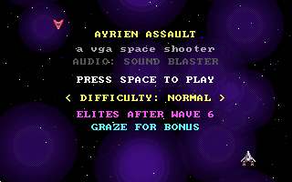
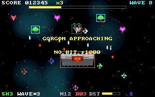
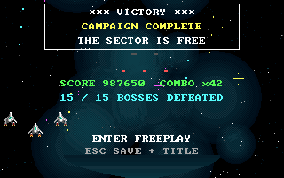

# Ayrien Assault

Ayrien Assault is a vertically scrolling VGA space shooter for period PC hardware:
an Intel 486, MS-DOS, VGA mode 13h, and classic DOS audio hardware. It is written
in C for 16-bit real mode with Open Watcom. The current DOS executable is about 148 KB;
the release floppy image is exactly 1,474,560 bytes, the standard 1.44 MB FAT12
floppy size. The browser port is included in `web/` for local or self-hosted deployment.





## Links

- Source repository: [github.com/FredApps/Stellar](https://github.com/FredApps/Stellar)
- MS-DOS release downloads: [latest release](https://github.com/FredApps/Stellar/releases/latest)

## Highlights

- 320x200x256 VGA mode 13h, double-buffered, and paced to about 35 FPS for
  consistent speed on 33 MHz, 66 MHz, and faster Pentium-class machines.
- Procedural scrolling nebula background, parallax stars, shaded sprites,
  engine flames, boss core effects, and fading particles.
- Weighted enemy waves, formation spawns, elite variants, and fifteen authored
  campaign bosses with unique silhouettes, movement bands, and attack patterns.
- Persistent weapon upgrades, homing missiles, smart bombs, Shift boost with
  a boost bar, shield ramming, graze bonuses, combo multipliers, adaptive drops,
  medals, and risk pickups.
- Clear four-level weapon progression: Laser gains one piercing lane per level,
  Wave widens from 5 to 11 shots, and marked boss supply escorts carry upgrades.
- Easy, Normal, and Hard difficulties share one high-score table; harder modes
  apply higher score multipliers.
- Eighteen remastered cues arranged for PC speaker, AdLib OPL2, Roland MT-32,
  Sound Blaster, and a dedicated stereo Web Audio mix in the browser port.
- Top-8 high-score table saved to `HISCORE.DAT`.
- Animated campaign-complete scene after the wave-60 Overlord, with optional
  freeplay whose boss durability is capped at the wave-60 level.
- No FPU required; it runs on a 486SX as well as a DX.

## Hardware Compatibility

Ayrien Assault targets IBM PC compatibles from the 486 era onward. The practical
baseline is a 33 MHz 486SX or 486DX with VGA and conventional DOS memory. A
math coprocessor is not required, and the game does not use XMS, EMS, protected
mode, DPMI, or an FPU.

Faster machines are supported. The native DOS build intentionally caps gameplay
near 35 FPS by waiting across VGA retraces, so a 486DX2/66, early Pentium,
Pentium MMX, or later DOS-capable PC should not make the game run at double
speed. Very slow 386/486-class machines may run below the cap if they cannot
finish the full update and 64 KB VGA copy in time.

Video requires a VGA-compatible adapter that supports BIOS mode 13h
(320x200, 256 colors) and standard VGA DAC/retrace ports. This includes common
ISA/VLB/PCI VGA and SVGA cards from the era as well as DOSBox-X. PC speaker is
the universal fallback; AdLib OPL2, Roland MT-32 through MPU-401 UART, and
Sound Blaster 2.0+ are optional.

Known-good environments include MS-DOS 3.3 or later, MS-DOS 5/6.x, Windows 9x
DOS mode, FreeDOS, and DOSBox-X. The release package includes both `AYRIEN.EXE`
and a standard 1.44 MB FAT12 floppy image.

## Requirements

| Component | Requirement |
|-----------|-------------|
| CPU | 486SX/DX 33 MHz baseline; faster 486/Pentium-class PCs supported |
| RAM | 4 MB nominal target, far less used at runtime |
| OS | MS-DOS 3.3 or later, Windows 9x DOS mode, FreeDOS, or DOSBox-X |
| Video | VGA mode 13h compatible adapter |
| Sound | PC speaker; optional AdLib OPL2, MT-32/MPU-401, or Sound Blaster 2.0+ |
| Storage | About 175 KB for `AYRIEN.EXE` plus `AYRIEN.SND`; floppy image is exactly 1.44 MB |

## Browser Port

The JS/Canvas port lives in `web/` and can be run locally or deployed to any static host.
It keeps the same 320x200 framebuffer and frame-locked game feel, while adding
a bounded stereo arcade Web Audio score, mouse and relative-drag steering, a mobile thumb control,
mobile fullscreen controls, replay/title score actions, and server leaderboard sync.

## Quick Start

Download the current MS-DOS build from the
[latest release](https://github.com/FredApps/Stellar/releases/latest), then run:

```text
A:\> AYRIEN
```

In DOSBox-X, mount the release floppy image or the directory containing the
executable:

```text
imgmount a AYRIEN.IMG -t floppy
a:
AYRIEN
```

## Build From Source

On Windows with Open Watcom V2 available:

```powershell
build\build.ps1
python build\mkfloppy.py dist\AYRIEN.IMG AYRIEN.EXE dist\AYRIEN.SND dist\README.TXT
```

On first interactive launch, choose a sound device; the choice is saved in
`AYRIEN.CFG`. Use `/SETUP`, `/PCSPK`, `/ADLIB`, `/MT32:330`,
`/SB:220,7,1`, or `/NOSOUND` to override it.

GitHub Actions builds release artifacts automatically when a `v*` tag is
pushed. Each release tag must have a matching section in
[CHANGELOG.md](CHANGELOG.md); the workflow copies that section into the GitHub
Release body and fails the tag build if the section is missing.

See [docs/BUILD.md](docs/BUILD.md) for local and CI details.

## Controls

| Key | Action |
|-----|--------|
| WASD / Arrows | Move in 8 directions |
| Shift | Boost while held |
| Space | Fire main gun |
| Ctrl | Launch homing missile |
| B | Smart bomb |
| P | Pause |
| M | Mute or unmute |
| H | Open or close Help from the title screen |
| Up / Down | Change title difficulty; scroll Help pages |
| Esc | Return to title or quit; quick-save/replay during high-score entry |

During boss fights, flying above the boss turns the ship and all weapons downward automatically.
Help has six pages; its on-screen Up/Down arrows show when more information is available.

Full gameplay reference is in [docs/GAMEPLAY.md](docs/GAMEPLAY.md).

## Repository Layout

```text
src/            C source, one module per subsystem
build/          build, packaging, and verification scripts
docs/           build, architecture, gameplay, and timing notes
dist/           player manual and screenshots; generated binaries are ignored
web/            browser port and leaderboard API source
.github/        release workflow
```

Local toolchains, DOSBox configs, generated EXEs, floppy images, high-score
files, and private deployment settings are intentionally not tracked.

## License

Ayrien Assault is released under the GNU General Public License version 3. See
[LICENSE](LICENSE).

## Contributors

See [CONTRIBUTORS.md](CONTRIBUTORS.md).

